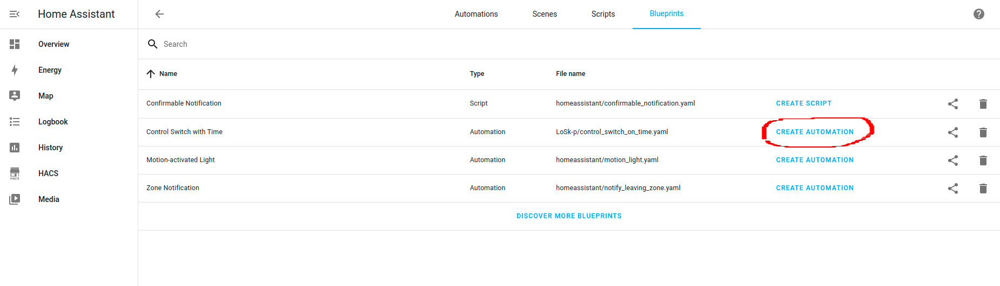

# Blueprints for Home Assistant
## Installation
Blueprints could be added with following:

1. Go to `Settings / Automation & Scenes / Blueprints` and press `Import Blueprint` in the lower right corner.
2. Paste github url of the needed yaml file and press `Preview Blueprint`.
3. Read a description and press `Import Blueprint`.

After you've added the blueprint press `Create Automation` near it:

## Blueprints

### Tested

- [Telegram bot notifications](./telegram-bot-notification/README.md)
- [Control Switch with Time](./switch-on-time/README.md)
- [Control switch with the sun](./sun-switch/README.md)
- [Notification if Door or Window is left open](./door-left-open/README.md)
- [Notification if Door or Window was opened](./door-opened-notifications/README.md)
- [Group Switches](./group-switch/README.md)
- Turn on/off light with motion sensor - build in to HA.
- [Climate control using external temperature sensor](./climate-control/README.md)

### Not tested

- [Alarm system integration](https://github.com/nielsfaber/alarmo)
- [Send camera snapshot notification on motion](https://community.home-assistant.io/t/send-camera-snapshot-notification-on-motion/254565)
- [Automatic circadian lighting](https://community.home-assistant.io/t/automatic-circadian-lighting-match-your-lights-color-temperature-to-the-sun/472105)
- [Vacation Lighting replay historical](https://community.home-assistant.io/t/vacation-lighting-replay-historical-lighting/282435)
- [Wake-up light alarm with sunrise effect](https://community.home-assistant.io/t/wake-up-light-alarm-with-sunrise-effect/255193)
- [Advanced scheduled heating control](https://community.home-assistant.io/t/advanced-scheduled-heating-control/469873)
- [Sensor Light - Motion Sensor - Sun Elevation](https://community.home-assistant.io/t/sensor-light-motion-sensor-sun-elevation-lux-value-scenes-time/481048)