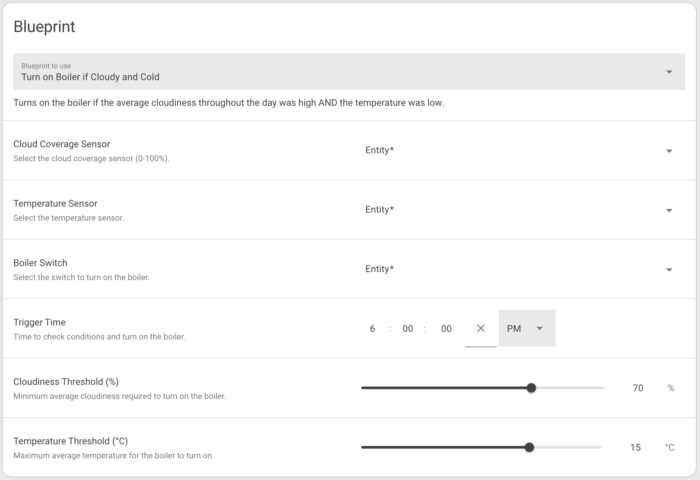

# Thrifty Boiler

> ```bash
> https://github.com/airalab/home-assistant-blueprints/blob/main/boiler-by-cloudiness/boiler-by-cloudiness.yaml
> ```

Most probably the blueprint could be used for most of the southern Europe, but I live on Cyprus and this automation targets a few months between winter and summer.

Context. A lot of buildings on Cyprus have a tank with water on the roof. During sunny and hot days this water gets hot so the residents can have a shower. Every apartment has a boiler switch that is basically an electrical heater for the water in case a day was cold, rainy, or with clouds. At March and April it's usually sunny and warm, but sometimes it rains. At days like this one doesn't know whether the boiler should be switched on or not.

With this automation you can set the level of cloudiness (in %) and temperature (in °C) during a day as conditions for the boiler switch.

For example, if cloudiness is more than 50% and temperature less than 22, then turn the boiler switch on. Otherwise it won't turn on and save you some electricity.

This blueprint requires two statistic variables to be set in `configuration.yaml`:

```yaml
sensor:
  - platform: template
    sensors:
      forecast_cloud_coverage:
        friendly_name: "Forecast Cloud Coverage"
        value_template: "{{ state_attr('weather.forecast_home', 'cloud_coverage') }}"
        unit_of_measurement: "%"

      forecast_temperature:
        friendly_name: "Forecast Temperature"
        value_template: "{{ state_attr('weather.forecast_home', 'temperature') }}"
        unit_of_measurement: "°C"

  - platform: statistics
    name: "Average Cloudiness Today"
    entity_id: sensor.forecast_cloud_coverage
    state_characteristic: mean
    sampling_size: 100
    max_age:
      hours: 11  # How many hours from the past, here from 7 AM to 6 PM

  - platform: statistics
    name: "Average Temperature Today"
    entity_id: sensor.forecast_temperature
    state_characteristic: mean
    sampling_size: 100
    max_age:
      hours: 11
```


