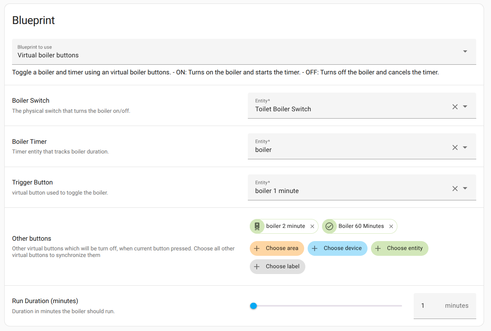
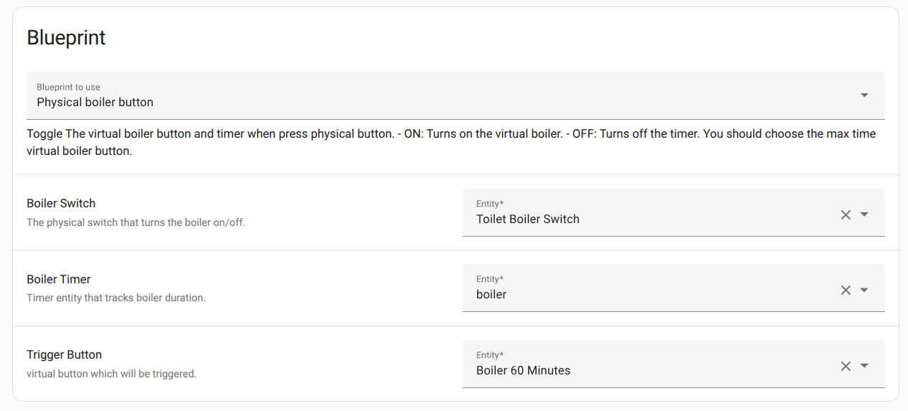

# Boiler Automation Setup Guide 

## Overview  
This guide explains how to set up automations to control your boiler using virtual buttons with countdown timers. 
This setup allows you to create multiple virtual buttons for different boiler operating times and control the boiler via a physical button or through the app.
With minor adjustments, this setup can also be used for other systems, such as underfloor heating.

## Setup  

### 1. Import Blueprints
Import the three blueprints included in this folder into your Home Assistant instance.

### 2. Create Boiler Control Buttons
Go to **Settings** → **Devices & Service**s → **Helpers**
Create new helpers of type Toggle (or define them in configuration.yaml):
```
input_boolean:
  boiler_main:
    name: "Boiler 60 Minutes"
    initial: off
  boiler_15:
    name: "Boiler 15 Minutes"
    initial: off
  boiler_30:
    name: "Boiler 30 Minutes"
    initial: off
  boiler_45:
    name: "Boiler 45 Minutes"
    initial: off
```

### 3.  Create a Timer
Create a timer that will track the remaining time. You can name it boiler_timer.

### 4. Create Automations for Virtual Buttons
Use the ``virtual_boiler_buttons`` blueprint to create automations for each virtual button.
For each automation:
- Select the physical boiler switch
- Select the timer
- Set the desired duration
- In the Other Buttons field, select all other virtual buttons (excluding the one this automation is for)
**Example**:
When creating the automation for "Boiler 15 Minutes", include the 30, 45, and 60-minute buttons in "Other Buttons".
Name the automation accordingly, e.g., Boiler 15 Minutes.
- 


Repeat this process for each virtual button following the same pattern.

These automations will turn on the boiler and start the timer for the specified duration.

### 5. Create “Boiler Timer Finish Actions” Automation
Use the ``boiler_timer_finish`` blueprint. Set the following:
- The physical boiler switch
- The timer
- All virtual buttons created (e.g., the 15, 30, 45, and 60-minute buttons)
- 


This automation will turn off all switches when the timer finishes.

### 6. Create “Physical Boiler Button” Automation
Use the ``physical_boiler_button`` blueprint. Configure:
- The physical boiler switch
- The timer
- One virtual button to activate (it is recommended to use the button with the maximum time; this logic has been tested)



This automation ensures the timer starts automatically when the physical button is pressed.

## Dashboard Display
For the best user experience:

Display all virtual buttons on the dashboard in ascending order (15, 30, 45, 60 minutes)
Add the timer to visualize the remaining boiler operating time.