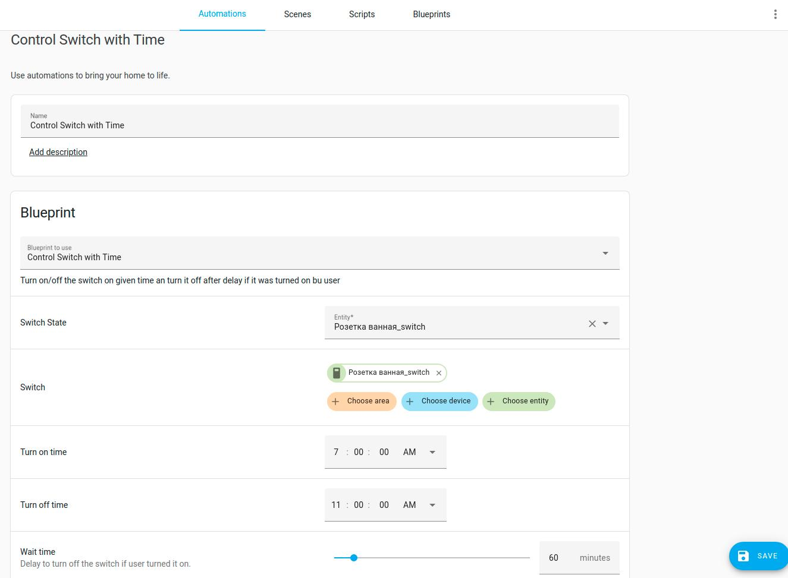

## Turn on/off Switch on Time

> Link to the file:
> ```
> https://github.com/LoSk-p/home-assistant-blueprints/blob/main/switch-on-time/control_switch_on_time.yaml
> ```

Fields description:

- `Switch State` and `Switch` must be **the same entity id** of controlled switch device.
- `Turn on time` and `Turn off time` is the time when you want tu turn on/off your switch.
- `Wait time` is the delay to turn off the switch if it was turned on by user.


