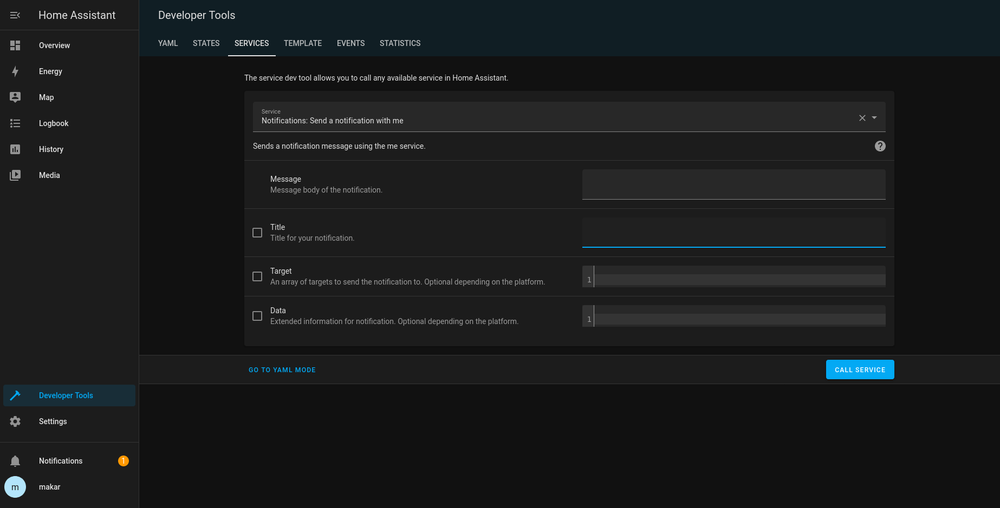

# Telegram bot notifications

Home assistant provide a way to send a notifications via telegram bot. Information about it, 
you can find in the official [website](https://www.home-assistant.io/integrations/telegram_broadcast).

## Installation

First, you have to create your own telegram bot. For this go to the special Telegram bot [@BotFather](https://t.me/botfather).
Follow instructions and get your bot API token.

> Keep your token secure and store it safely, it can be used by anyone to control your bot.

Next step is find your **user chat id**. For this visit special bot - [GetIdsBot](https://t.me/getidsbot). 
Press `start` button and it will provide information about you profile. We need **id** parameter.

## Home Assistant

Next step is add **telegram notifications** to your Home assistant. 
For do this you have to add the following section to your `configuration.yaml` file:
```shell
# Example configuration.yaml entry
telegram_bot:
  - platform: broadcast
    api_key: <YOUR_API_KEY>
    allowed_chat_ids:
      -  <YOUR_CHAD_ID> # 123456789  example id of a user
      
notify:
  - platform: telegram
    name: <NOTIFIER_NAME>
    chat_id: <YOUR_CHAD_ID>
```

To do this you can you connect to your Home Assistant with `ssh`, if you use Home Assistant Core or Docker container.
If you are use Home Assistant OS, then use `File Editor` [add-on](https://www.home-assistant.io/getting-started/configuration/).

Save configuration and reload Home Assistant.

## Result

After all you will have new service in **Developer Tools->Services** with name `notify.<NOTIFIER_NAME>`. 


You can use this service in any interrogations, which use **notify_service**.